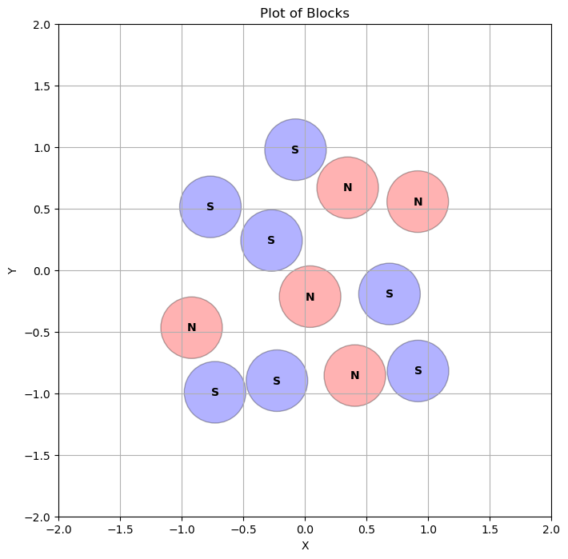
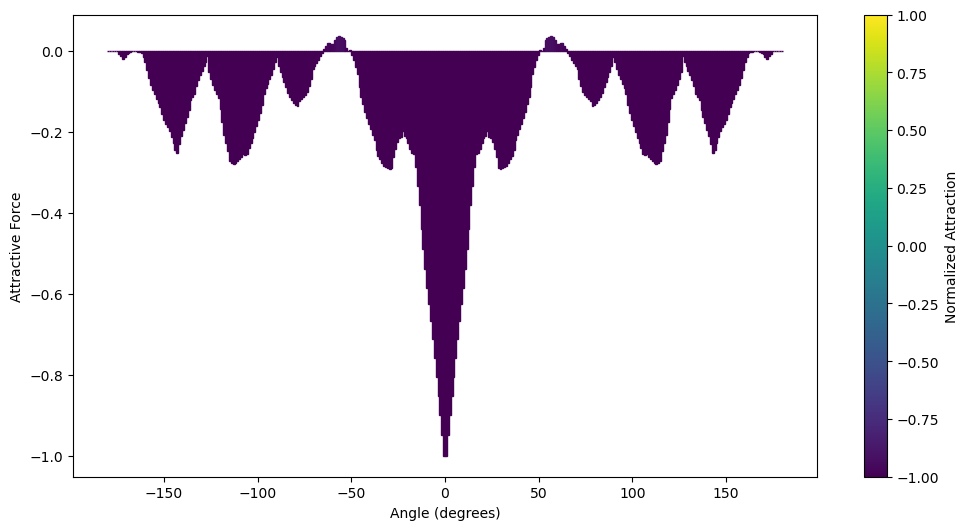
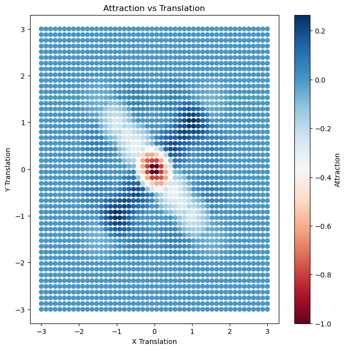

block is a library designed to study and visualize encodings and their interactions under rotation and translation.

# Key Components

1. **Block Class**: Encapsulates tensor data with polarity information for calculating attraction between blocks.
2. **Plotting Functions**: Include `plot_faces` for visualizing tensor faces with polarities.
3. **Utility Functions**: Convert tensors to points using `tensor_to_points`.

# Installation
To install the block library, follow these steps:

## Pre-requisites:
- Python 3.8 or higher
- pip3
## Installation via GitHub:
1. Clone the repository:
```bash
git clone https://github.com/your-username/block.git
```
2. Navigate into the cloned repository:
```bash
cd block
```
3. Install the package in editable mode:
```bash
pip3 install -e .
```
## Requirements:
Ensure you have the necessary dependencies installed. You can install them using:
```bash
pip install torch scipy numpy matplotlib
```
Or, if you prefer to manage dependencies via a requirements.txt file, you can create one with the following content:
```text
torch
scipy
numpy
matplotlib
```
Then, install the dependencies using:
```bash
pip3 install -r requirements.txt
```
## Optional: Conda Environment Setup
For those who prefer using Conda, you can create a dedicated environment:
```bash
conda create --name block-env python=3.8
conda activate block-env
pip install git+https://github.com/your-username/block.git
```
Make sure to replace your-username with your actual GitHub username and adjust the repository URL accordingly.
### Notes
- Ensure you have Git installed if you choose to clone the repository.
- If you encounter issues with dependencies, consider using a virtual environment to manage them more effectively.

# Testing

to run all tests, run
```bash
python3 -m unittest discover -s block/tests -p 'test_*.py'
```

to run individual test, run
```bash
python3 -m unittest discover -s block/tests -p 'test_{test name here}.py'
```

# API Reference

## Block
The block.py module defines the Block class, which represents a set of points with polarities and radii. It provides methods for manipulating and analyzing these blocks.

### Block Class
#### Class Methods
```py
__init__(points: torch.Tensor, polarities: torch.Tensor, radii: torch.Tensor):
```
Initializes a Block object with the given points, polarities, and radii.

```py
mate() -> Block:
```
Returns a new Block that is the "mate" of the current block, with opposite polarities.

```py
clone() -> Block:
```
Creates a copy of the current block.

```py
calculate_attraction(other: Block) -> Tuple[torch.Tensor, float]:
```
Calculates the attraction between the current block and another block.

```py
as_tuple() -> Tuple[torch.Tensor, torch.Tensor, torch.Tensor]:
```
Returns the points, polarities, and radii of the block as a tuple.

```py
rotate(theta, mode='d') -> None:
```
Rotates the block by the specified angle.

```py
transform(A: torch.Tensor) -> None:
```
Applies a linear transformation to the block's points.

```py
translate(A: torch.Tensor) -> None:
```
Translates the block's points by the specified vector.

#### Methods
```py
rotate(block: Block, theta, mode='d') -> Block:
```
Returns a new block that is the result of rotating the given block.

```py
translate(block: Block, A: torch.Tensor) -> Block:
```
Returns a new block that is the result of translating the given block.

```py
calculate_attraction(block1: Block, block2: Block) -> Tuple[torch.Tensor, float]:
```
Calculates the attraction between two blocks.

## Generators Module
The generators.py module provides functions for generating blocks based on different criteria.

### Methods
```py
gen_had_block(n: int) -> Block:
```
Generates a block based on an n x n Hadamard matrix.

```py
gen_rand_block(n: int, func: Callable[[], float], bounds: Tuple[float, float, float, float] = (-1, 1, -1, 1), polarities: Optional[torch.Tensor] = None) -> Block:
```
Generates a block with random points and radii within the specified bounds.

## Plot

The plot module provides functions for visualizing blocks and their interactions.

### Functions

```py
plot_faces(blocks: list, zoom_factor: float = 2, alpha: float = 0.3):
```
Plots a list of blocks. Each block is represented by circles with colors indicating polarity.



```py
plot_rotation_attraction(block1: Block, block2: Block, num_angles: int = 160)
```
Plots the attraction between two blocks as a function of rotation.




```py
plot_translation_attraction(block1: Block, block2: Block, num_x: int = 20, num_y: int = 20, lo: int = -2, hi: int = 2)
```
Plots the attraction between two blocks as a function of translation.



## Usage Example

check out examples/

### TODO
- [ ] For plots showing overlapping N & S pixels: show a distinct color for attraction, another color for repulsion
- [ ] Don't normalize - we care about overlapping areas to compare different resolutions
- [ ] Animation of the rotating surfaces alongside a graph
- [ ] Earnshaw's theorem
- [ ] non-linear programming for designing N/S placement to shape a potential well

## References

1. **SGDAT: An Optimization Method for Binary Neural Networks**
    - https://arxiv.org/pdf/2302.11062
2. **DPCD: Discrete Principal Coordinate Descent for Binary Variable Problems** by Huan Xiong
    - https://econ.la.psu.edu/wp-content/uploads/sites/5/2022/01/GenRanCorr.pdf
3. **Determinant Optimization on Binary Matrices**
    - https://www.researchgate.net/publication/216813262_Determinant_Optimization_on_Binary_Matrices
4. **The Hadamard decomposition problem**
    - https://www.researchgate.net/publication/380756108_The_Hadamard_decomposition_problem
5. https://openreview.net/forum?id=rvhu4V7yrX
6. https://dspace.mit.edu/bitstream/handle/1721.1/108443/Soljacic_Binary matrices.pdf?sequence=1
7. https://arxiv.org/pdf/2110.02560
8. https://www.researchgate.net/publication/220240951_New_Matrices_with_Good_Auto_and_Cross-Correlation
9. https://asp-eurasipjournals.springeropen.com/articles/10.1186/s13634-017-0455-2
10. https://pubmed.ncbi.nlm.nih.gov/33449928/
11. https://ocw.mit.edu/courses/6-972-algebraic-techniques-and-semidefinite-optimization-spring-2006/813f1063132bcd1abe4283d7c9f75816_lecture_03.pdf
12. https://users.cs.duke.edu/~reif/paper/urmi/magneticAssembly/magneticAssembly.pdf
13. https://www.researchgate.net/publication/221344528_Three_Dimensional_Stochastic_Reconfiguration_of_Modular_Robots
14. https://journals.aps.org/prx/pdf/10.1103/PhysRevX.14.021004
15. https://www.nature.com/articles/s41467-022-32892-y
16. https://ijmttjournal.org/public/assets/volume-59/number-4/IJMTT-V59P532.pdf
