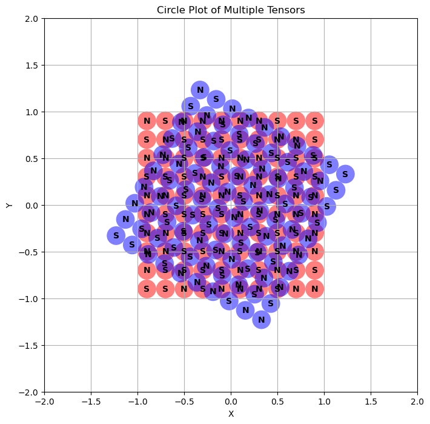

block is a library designed to study and visualize encodings and their interactions under rotation and translation.

## Key Components

1. **Block Class**: Encapsulates tensor data with polarity information for calculating attraction between blocks.
2. **Plotting Functions**: Include `plot_faces` for visualizing tensor faces with polarities.
3. **Utility Functions**: Convert tensors to points using `tensor_to_points`.

## Installation

To install MTProject:

1. lorem
2. epsum
3. lorem...
4. do this still

## API Reference

### Block Class

The `Block` class is the core component of the library, representing a block structure with associated tensor data and polarities.

#### Constructor

```python
Block(tensor: torch.Tensor)
```

Initializes a Block object with a 2D tensor representing the block's structure.

#### Class Methods

```python
@classmethod
from_block(cls, other: Block) -> Block
```

Creates a new Block instance by cloning another Block.

#### Static Methods

```python
@staticmethod
calculate_attraction(block1: Block, block2: Block) -> Tuple[torch.Tensor, float]
```

Calculates the attraction between two blocks, returning a tensor of attraction forces and the sum of forces normalized by the number of elements in block1.

#### Instance Methods

```python
rotated(self, theta: float, mode: str = 'd') -> Block
```

Returns a new Block with points rotated by the given angle theta.

```python
rotate(self, theta: float, mode: str = 'd') -> None
```

Rotates the points of the current Block by the given angle theta in-place.

### Plotting Functions

```python
plot_faces(blocks: Union[Block, List[Block]], colors: List[str], zoom_factor: float = 2, alpha: float = 0.5) -> None
```

Visualizes one or more Blocks, displaying their points as circles with polarities indicated by 'N' or 'S' markers.



## Usage Example

blah blah blah

## References

1. **SGDAT: An Optimization Method for Binary Neural Networks**
    - https://arxiv.org/pdf/2302.11062
2. **DPCD: Discrete Principal Coordinate Descent for Binary Variable Problems** by Huan Xiong
    - https://econ.la.psu.edu/wp-content/uploads/sites/5/2022/01/GenRanCorr.pdf
3. **Determinant Optimization on Binary Matrices**
    - https://www.researchgate.net/publication/216813262_Determinant_Optimization_on_Binary_Matrices
4. **The Hadamard decomposition problem**
    - https://www.researchgate.net/publication/380756108_The_Hadamard_decomposition_problem
5. https://openreview.net/forum?id=rvhu4V7yrX
6. https://dspace.mit.edu/bitstream/handle/1721.1/108443/Soljacic_Binary matrices.pdf?sequence=1
7. https://arxiv.org/pdf/2110.02560
8. https://www.researchgate.net/publication/220240951_New_Matrices_with_Good_Auto_and_Cross-Correlation
9. https://asp-eurasipjournals.springeropen.com/articles/10.1186/s13634-017-0455-2
10. https://pubmed.ncbi.nlm.nih.gov/33449928/
11. https://ocw.mit.edu/courses/6-972-algebraic-techniques-and-semidefinite-optimization-spring-2006/813f1063132bcd1abe4283d7c9f75816_lecture_03.pdf
12. https://users.cs.duke.edu/~reif/paper/urmi/magneticAssembly/magneticAssembly.pdf
13. https://www.researchgate.net/publication/221344528_Three_Dimensional_Stochastic_Reconfiguration_of_Modular_Robots
14. https://journals.aps.org/prx/pdf/10.1103/PhysRevX.14.021004
15. https://www.nature.com/articles/s41467-022-32892-y
16. https://ijmttjournal.org/public/assets/volume-59/number-4/IJMTT-V59P532.pdf
